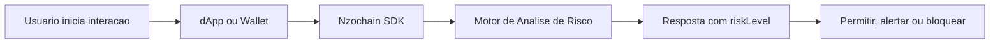

# Nzochain

A **Nzochain** e uma plataforma de seguranca Web3 proativa desenvolvida pela **ASC AXIOM TECH** para interceptar risco antes da assinatura virar estado imutavel na blockchain.

Em fluxos tradicionais de seguranca, a protecao acontece tarde demais. O usuario interage com um contrato, assina a transacao e, somente depois de um evento malicioso ou de uma drenagem de ativos, ferramentas reativas entram em cena para revogar aprovacoes ou orientar a resposta ao incidente.

A Nzochain inverte essa logica.

Antes de uma assinatura ser concluida, a plataforma executa analises em tempo real sobre:

- contratos de destino potencialmente maliciosos;
- padroes de **Infinite Approval** em tokens ERC-20;
- combinacoes de permissao, spender e contexto da carteira;
- indicadores de risco que podem levar a phishing, asset draining ou escalacao de privilegios.

## Da seguranca reativa para a prevencao proativa

O problema central de muitas stacks Web3 nao e apenas detectar fraude. E detectar fraude **antes** da confirmacao da transacao.

Com a Nzochain, seu produto pode:

- bloquear fluxos inseguros antes da assinatura;
- classificar risco de contratos e aprovacoes em tempo real;
- reduzir dependencia de revogacao manual apos o incidente;
- incorporar inteligencia de seguranca diretamente na UX da wallet, dApp ou backend.

## Como isso funciona

Em alto nivel, a Nzochain expande a camada de seguranca da sua aplicacao com um fluxo de avaliacao pre-flight:

1. Sua aplicacao coleta o contexto da operacao.
2. O SDK envia sinais relevantes para a API da Nzochain.
3. O motor de analise retorna um veredito de risco.
4. Sua interface decide se permite, alerta ou bloqueia a assinatura.

## Casos de uso

- Wallets que precisam alertar usuarios sobre contratos suspeitos antes da assinatura.
- dApps que desejam reduzir risco operacional e reputacional.
- Backends de compliance e monitoramento que precisam enriquecer transacoes com contexto de seguranca.
- Produtos DeFi, NFT e gaming que lidam com aprovacoes frequentes de tokens.

## O que voce encontra nesta documentacao

- Um guia rapido para instalar e inicializar o SDK.
- Exemplos de analise de transacao em TypeScript.
- Referencia para fluxos de gerenciamento de aprovacoes.

Se voce esta integrando a Nzochain pela primeira vez, siga para o **Quickstart**.
